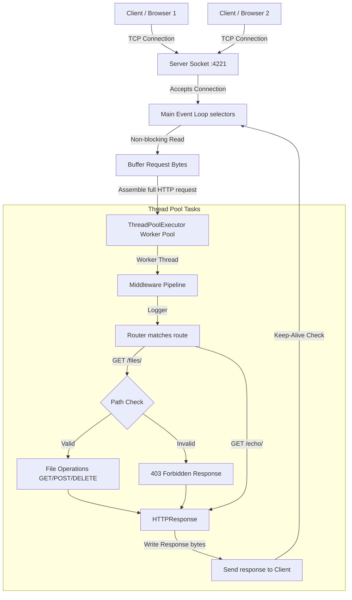

# Custom Python HTTP Server & Web Framework

A high-performance, modular HTTP/1.1 server and web framework built from scratch in Python. 

This project implements **non-blocking I/O multiplexing (`epoll`/`kqueue`)** via the standard `selectors` library, combined with a **Thread Pool worker queue** to offload blocking routing and filesystem operations. It features an Express/Koa-style middleware pipeline and custom routing.

---

## Features

- **Asynchronous Event Loop**: Uses `selectors` (`epoll` on Linux, `kqueue` on macOS) for non-blocking socket polling.
- **Worker Thread Pool**: Pre-allocated `ThreadPoolExecutor` offloads filesystem and route handler blocking tasks.
- **Middleware Pipeline**: Onion-style recursive middleware execution pipeline (`request, next_handler`).
- **Dynamic Routing**: Dynamic path parameter matching (e.g., `/echo/:string`).
- **Persistent Connections**: HTTP/1.1 `Connection: Keep-Alive` pipelined socket reuse.
- **Content Negotiation**: Dynamic GZIP compression.
- **Directory Traversal Protection**: Validation via canonical filesystem checks (`os.path.realpath`) to secure static file endpoints.
- **MIME-Type Resolution**: Automatic file content detection via Python's standard `mimetypes` library.
- **Logger**: Built-in access logging middleware.

---

## Architecture



### Concurrency Model
1. **Network I/O**: The server runs a single-threaded event loop. All client socket connections are set to non-blocking mode and monitored for reading. 
2. **Task Offloading**: Reading raw request bytes is handled directly on the main event loop thread. Once the headers and full body are assembled, the request is offloaded as a task to a pre-allocated worker pool of threads.
3. **Keep-Alive**: After a worker thread finished writing response bytes to the client socket, the socket is re-registered back to the selectors event loop to wait for subsequent requests.

---

## Project Structure

The framework is split into distinct modules following OOP and SOLID principles:
- `core/server.py`: Socket listener, event loop, and thread pool orchestration.
- `core/request.py` & `core/response.py`: HTTP request parsing and response serializing.
- `routing/router.py`: Route mapping and path parameter resolver.
- `middleware/`: Pipeline execution engine and built-in middleware modules.

---

## How to Run

### Local Execution
Set the `PYTHONPATH` when starting the server to resolve package imports:
```bash
mkdir -p sandbox
PYTHONPATH=. python3 app/main.py --directory ./sandbox
```

### Docker Execution
Run the server in a containerized environment:
```bash
# Build and start in foreground
docker-compose up --build

# Run in background
docker-compose up -d

# Stop container
docker-compose down
```

---

## Custom Framework Usage

To use this project as a lightweight web framework, import the server and response classes:

```python
from app.core.server import HTTPServer
from app.core.response import HTTPResponse

# Initialize server
server = HTTPServer(host="0.0.0.0", port=4221, max_workers=10)

# Register a custom middleware
def custom_middleware(request, next_handler):
    print(f"Request intercepted: {request.path}")
    return next_handler(request)

server.pipeline.use(custom_middleware)

# Register a dynamic route
def hello_handler(request):
    name = request.path_params.get("name", "World")
    return HTTPResponse(status=200, body=f"Hello, {name}!".encode("utf-8"))

server.router.add_route("GET", "/hello/:name", hello_handler)

# Start Event Loop
server.start()
```

---

## Benchmarking Guide (Comparing with Flask)

You can benchmark this server against a standard Python Flask application using load-testing tools like **Apache Bench (`ab`)** or **`wrk`**.

### 1. Test Setup
Start both servers on different ports (e.g. our custom server on `:4221` and a basic Flask app on `:8080`).

### 2. Running Benchmarks
Send 10,000 requests with a concurrency of 100 requests at the `/` endpoint:
```bash
# Benchmark our Custom Server
ab -n 10000 -c 100 http://localhost:4221/

# Benchmark Flask
ab -n 10000 -c 100 http://localhost:8080/
```

---

## Performance & Benchmarks

Here are the actual metrics gathered by running `ab` on a local Mac:

| Metric | Custom HTTP Server (Our Framework) | Python Flask (Werkzeug) | Comparison |
| :--- | :--- | :--- | :--- |
| **Requests per Second (RPS)** | **1,197.62 rps** | 1,023.22 rps | **Custom Server is ~17% Faster** |
| **Total Time Taken** | **8.350 seconds** | 9.773 seconds | **Custom Server completes ~14.5% faster** |
| **Average Latency (mean)** | **83.499 ms** | 97.731 ms | **Custom Server has ~14.5% lower latency** |
| **Max Tail Latency (100%)** | **293 ms** | 442 ms | **Custom Server has ~33% lower tail latency** |

---

## Testing Endpoints

#### 1. Root Path
```bash
curl -v http://localhost:4221/
```

#### 2. Echo with Gzip Decompression
```bash
curl -v http://localhost:4221/echo/hello_world --compressed
```

#### 3. Fetch User-Agent
```bash
curl -v http://localhost:4221/user-agent -H "User-Agent: my-custom-agent"
```

#### 4. File Actions (POST, GET, DELETE)
```bash
# Upload
curl -v -X POST http://localhost:4221/files/hello.txt -d "Written through custom server"
# Download
curl -v http://localhost:4221/files/hello.txt
# Delete
curl -v -X DELETE http://localhost:4221/files/hello.txt
```

#### 5. Directory Traversal Security Test
```bash
curl -v --path-as-is http://localhost:4221/files/../../../../etc/passwd
```

---

## License

This project is licensed under the MIT License - see the [LICENSE](file:///Users/akshatkankani/Desktop/Github/custom-http-server/LICENSE) file for details.
