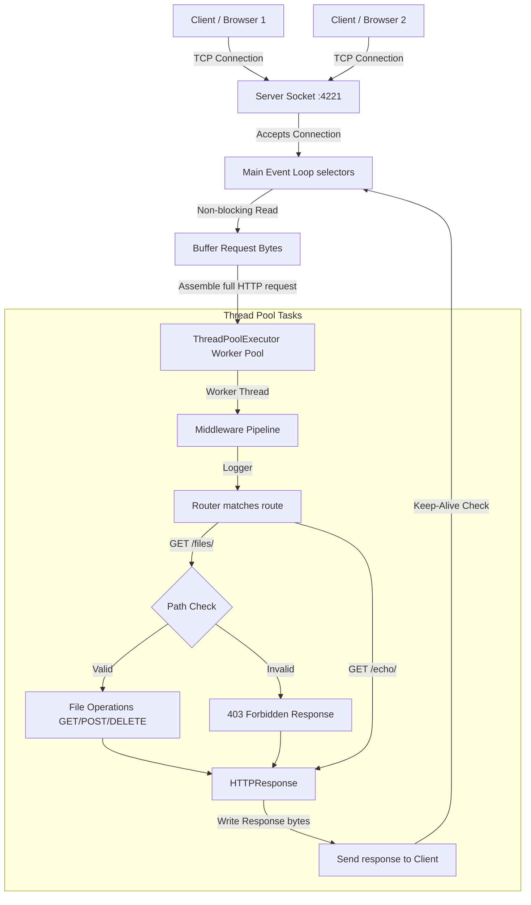

# Custom Python HTTP Server & Web Framework

A modular, high-performance HTTP/1.1 server and lightweight framework built from scratch in Python. It uses an event-driven networking architecture with non-blocking I/O (`selectors`), a task-dispatching worker thread pool, Express-style middleware, dynamic path variable routing, and persistent HTTP/1.1 connections.

---

## Core Features

* **Async Event Loop**: Event-driven network loop using I/O multiplexing (`selectors` wrapping `epoll`/`kqueue`) for non-blocking socket polling.
* **ThreadPool Offloading**: Pre-allocated thread pool (`ThreadPoolExecutor`) to process routing handlers and file I/O tasks, keeping the event loop responsive.
* **Onion Middleware**: A recursive middleware chain pipeline (`request, next_handler`) resembling Express/Koa architecture.
* **Parametric Routing**: Dynamic path parameter parsing and pattern matching (e.g., `/echo/:string`).
* **Keep-Alive**: Support for persistent TCP connections to eliminate repetitive handshake overhead.
* **GZIP Compression**: Automated runtime payload compression based on client request headers.
* **Directory Traversal Defense**: Canonical path validation (`os.path.realpath`) blocking file access outside the sandbox folder.
* **MIME Resolution**: Automated header detection using the standard system mime database.

### Performance Highlights
* **~1,200 requests/sec** throughput.
* **~17% higher throughput** than Flask under this raw benchmarking workload.
* **~14.5% lower** average latency.
* **~33% lower** tail latency.

---

## Architecture



### Concurrency Design
* **Event Loop Thread**: Monitors active connections, reads incoming bytes into session buffers, and detects request boundaries (`\r\n\r\n` + `Content-Length`).
* **Task Queue**: Once a request is fully assembled, the event loop unregisters the client socket and hands the task off to the Thread Pool.
* **Connection Re-registration**: After writing the response, the worker thread checks the keep-alive status. If persistent, it registers the socket back to the event loop.

---

## Design Goals

* **Modular Architecture**: Restructured from a monolith into clean, single-responsibility modules.
* **Separation of Concerns**: Disconnected request/response formatting, router matching, and socket loop layers.
* **Extensible Middleware**: Clean interfaces allowing third-party extensions to wrap route execution.
* **Thread Safety**: State maps and selector registrations synchronized via thread lock primitives.

---

## Directory Structure

```
custom-http-server/
 ├── app/
 │    ├── core/
 │    │    ├── request.py       # HTTPRequest parsing
 │    │    ├── response.py      # HTTPResponse serialization
 │    │    └── server.py        # Selector loop and ThreadPool manager
 │    ├── middleware/
 │    │    ├── base.py          # Middleware pipeline engine
 │    │    ├── logger.py        # Format console logging
 │    │    └── static.py        # Static file actions & path defenses
 │    ├── routing/
 │    │    └── router.py        # Path parameter match routing
 │    └── main.py               # Framework setup and routes register
 ├── docs/
 │    ├── adr_architecture.md   # Architectural Decision Record
 │    ├── definitions.md        # Technical definitions guide
 │    └── interview_defense.md  # System design prep defense
 ├── Dockerfile
 └── Docker-compose.yaml
```

---

## How to Run

### Local Execution
Specify the target sandbox directory and launch with `PYTHONPATH`:
```bash
mkdir -p sandbox
PYTHONPATH=. python3 app/main.py --directory ./sandbox
```

### Docker Execution
Or start the containerized service:
```bash
docker-compose up --build
```

---

## Framework Usage Example

To write applications using this project as a framework:

```python
from app.core.server import HTTPServer
from app.core.response import HTTPResponse

server = HTTPServer(host="0.0.0.0", port=4221, max_workers=10)

# Register custom middleware
def custom_middleware(request, next_handler):
    print(f"Request intercepted: {request.path}")
    return next_handler(request)

server.pipeline.use(custom_middleware)

# Register route
def hello_handler(request):
    name = request.path_params.get("name", "World")
    return HTTPResponse(status=200, body=f"Hello, {name}!".encode("utf-8"))

server.router.add_route("GET", "/hello/:name", hello_handler)

server.start()
```

---

## Benchmarking Guide

You can compare this server against a standard Flask setup using Apache Bench (`ab`):

```bash
# 1. Start our server on port 4221, and Flask on port 8080
# 2. Run ab load-test (10,000 requests, 100 concurrency)
ab -n 10000 -c 100 http://localhost:4221/
ab -n 10000 -c 100 http://localhost:8080/
```

---

## Performance & Benchmarks

The following metrics were gathered locally on a MacBook Air:

| Metric | Custom HTTP Server (Our Framework) | Python Flask (Werkzeug) | Comparison |
| :--- | :--- | :--- | :--- |
| **Requests per Second (RPS)** | **1,197.62 rps** | 1,023.22 rps | **Custom Server is ~17% Faster** |
| **Total Time Taken** | **8.350 seconds** | 9.773 seconds | **Custom Server completes ~14.5% faster** |
| **Average Latency (mean)** | **83.499 ms** | 97.731 ms | **Custom Server has ~14.5% lower latency** |
| **Max Tail Latency (100%)** | **293 ms** | 442 ms | **Custom Server has ~33% lower tail latency** |

### Benchmark Specifications
- **Hardware**: MacBook Air M2 (8-core CPU, 16 GB RAM)
- **Parameters**: `ab -n 10000 -c 100` targeting `/` route
- **Software**: Python 3.13.5, Flask 3.1.3, Werkzeug 3.1.8

### Performance Analysis
* **Network Multiplexing**: The single-threaded `selectors` loop monitors client sockets via kernel-level event descriptors. Idle sockets consume no CPU context-switching overhead.
* **Worker Execution Queue**: Thread allocation costs are paid upfront during startup. Socket workloads are dispatched as task pointers to the thread pool, preventing thread-per-connection scaling failures.
* **Low Overhead Routing**: We omit heavy routing engines, application context loaders, and request/response abstraction layers found in general-purpose frameworks like Flask.

*Note: Flask is a feature-rich, general-purpose framework. This benchmark measures a raw throughput workload under a specific concurrency level; the results demonstrate the efficiency of our low-level hybrid networking model rather than suggesting this server is broadly "better" than Flask.*

---

## Testing Endpoints

```bash
# 1. Root
curl -v http://localhost:4221/

# 2. Echo with compression
curl -v http://localhost:4221/echo/hello_world --compressed

# 3. User-Agent
curl -v http://localhost:4221/user-agent -H "User-Agent: my-custom-agent"

# 4. File uploads/downloads
curl -v -X POST http://localhost:4221/files/hello.txt -d "Written through custom server"
curl -v http://localhost:4221/files/hello.txt
curl -v -X DELETE http://localhost:4221/files/hello.txt

# 5. Directory Traversal test
curl -v --path-as-is http://localhost:4221/files/../../../../etc/passwd
```

---

## License

This project is licensed under the MIT License - see the [LICENSE](file:///Users/akshatkankani/Desktop/Github/custom-http-server/LICENSE) file for details.
