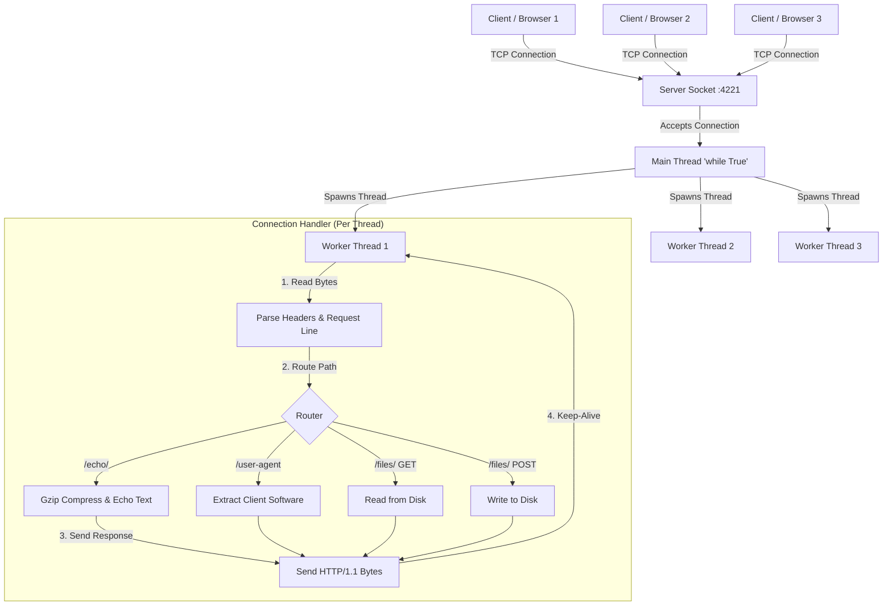

# Python HTTP Server

A lightweight, robust, and custom-built HTTP/1.1 server written entirely from scratch in Python. 

Built exclusively using the standard `socket` library, this project bypasses modern frameworks to demonstrate a fundamental, bare-metal understanding of networking protocols, TCP socket programming, and the HTTP/1.1 specification.

## Features
- **TCP Socket Management**: Low-level binding, listening, and accepting of raw network connections.
- **Concurrent Threading**: Capable of handling massive traffic via isolated background threads for each connection.
- **Persistent Connections**: Implements `Keep-Alive` logic to reuse TCP connections across multiple requests.
- **Content Negotiation**: Supports dynamic `gzip` compression based on client `Accept-Encoding` headers.
- **Dynamic Routing**: URL path parsing and routing for endpoints.
- **File System Operations**: Safely reads, writes, and serves binary files (`application/octet-stream`) directly from disk based on `POST` and `GET` requests.

## Architecture



## 📚 Core HTTP Concepts Explored

Building this server required implementing several foundational networking concepts from scratch:
- **TCP Sockets:** The underlying "phone lines" of the internet. The server binds to a port and listens for incoming raw bytes, avoiding the abstractions provided by modern web frameworks.
- **The HTTP Request Lifecycle:** Manually parsing the Request Line (`GET /path HTTP/1.1`), extracting headers line-by-line, and separating the HTTP body using the standard `\r\n\r\n` byte sequence.
- **Persistent Connections (Keep-Alive):** In HTTP/1.1, connections are kept open by default to reduce latency. The server manages a `while True` loop over the socket, processing multiple sequential requests until the client explicitly sends a `Connection: close` header or disconnects.
- **Content Negotiation:** The server dynamically inspects `Accept-Encoding` headers to determine if the client supports decompression, and actively uses the `gzip` algorithm to shrink response bodies, updating the `Content-Length` and `Content-Encoding` headers accordingly.

## How to Run

1. **Start the server:** 
Provide a directory argument to configure where the server should save and serve files from.
```bash
python3 app/main.py --directory /tmp/
```

2. **Test Endpoints:**
Open a new terminal and test the server's concurrent capabilities using cURL.

**Root Path:**
```bash
curl -v http://localhost:4221/
```

**Echo with GZIP Compression:**
```bash
curl -v http://localhost:4221/echo/hello_world -H "Accept-Encoding: gzip"
```

**Upload a File (POST):**
```bash
curl -v -X POST http://localhost:4221/files/new_file.txt -d 'Hello this is my test file'
```

**Download a File (GET):**
```bash
curl -v http://localhost:4221/files/new_file.txt
```
