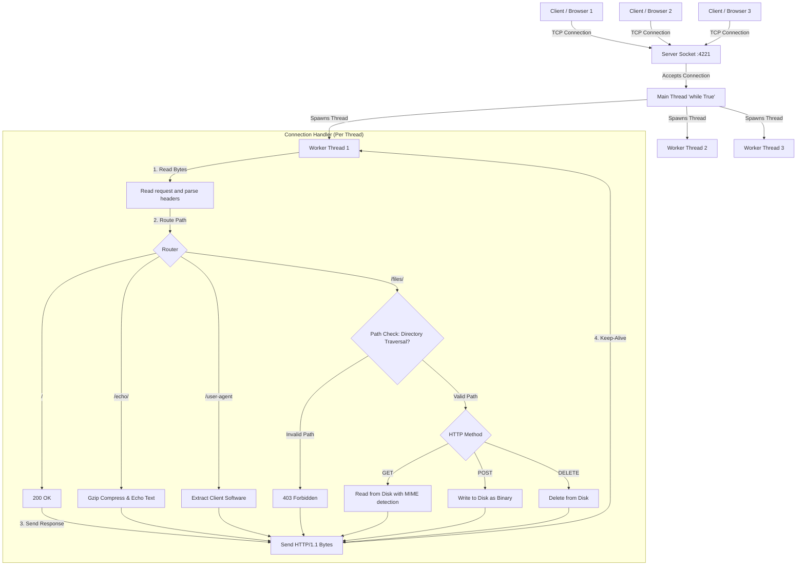

# Python HTTP Server

A lightweight, robust, and custom-built HTTP/1.1 server written entirely from scratch in Python. 

Built exclusively using standard libraries (`socket`, `threading`, `mimetypes`, `gzip`), this project bypasses web frameworks to demonstrate a fundamental, bare-metal understanding of networking protocols, TCP socket programming, and the HTTP/1.1 specification.

---

## Features

- **TCP Socket Management**: Low-level binding (`0.0.0.0:4221`), listening, and accepting of raw network connections.
- **Concurrent Threading**: Spawns background worker threads for each connection to handle traffic concurrently.
- **Persistent Connections**: Implements `Connection: Keep-Alive` to reuse TCP sockets for subsequent requests.
- **Content Negotiation**: Inspects `Accept-Encoding` headers and dynamically compresses body payloads using `gzip`.
- **MIME-Type Resolution**: Automatically determines and sets the correct HTTP `Content-Type` header (e.g. `text/html`, `image/png`, `application/json`) when serving files.
- **Binary File Handling**: Safe binary mode read/writes for serving non-corrupted media files.
- **HTTP Methods Support**: Dynamic routing supporting `GET`, `POST`, and `DELETE` requests.
- **Security Check**: Active Directory Traversal protection utilizing canonical absolute path validation (`os.path.realpath`) to restrict access outside the designated target folder.
- **Request Logging**: Thread-safe formatted console outputs logging client details, timestamps, requested path, method, and return status codes.

---

## Architecture



### How it works:
1. The **Main Thread** constantly listens for new incoming TCP connections on Port `4221` and IP `0.0.0.0`.
2. When a client connects, the Main Thread immediately passes that connection to a new background **Worker Thread**. This concurrent architecture allows the server to handle multiple clients simultaneously without blocking.
3. The Worker Thread reads the raw HTTP byte stream from the client, parses the headers, and routes the request to the appropriate endpoint logic.
4. Because the server implements **Persistent Connections**, the Worker Thread does not instantly terminate the connection after replying. Instead, it loops back to the beginning and waits for the client's next request, only destroying the thread if the client sends a `Connection: close` header or unexpectedly disconnects.

---

## Core HTTP Concepts Explored

Building this server required implementing several foundational networking concepts from scratch:
- **TCP Sockets:** The underlying "phone lines" of the internet. The server binds to a port and listens for incoming raw bytes, avoiding the abstractions provided by modern web frameworks.
- **The HTTP Request Lifecycle:** Manually parsing the Request Line (`GET /path HTTP/1.1`), extracting headers line-by-line, and separating the HTTP body using the standard `\r\n\r\n` byte sequence.
- **Persistent Connections (Keep-Alive):** In HTTP/1.1, connections are kept open by default to reduce latency. The server manages a `while True` loop over the socket, processing multiple sequential requests until the client explicitly sends a `Connection: close` header or disconnects.
- **Content Negotiation:** The server dynamically inspects `Accept-Encoding` headers to determine if the client supports decompression, and actively uses the `gzip` algorithm to shrink response bodies, updating the `Content-Length` and `Content-Encoding` headers accordingly.
- **Directory Traversal Defense:** Sanitizing and verifying file paths via canonical address resolution to lock down endpoint folder access.

---

## How to Run

### Method 1: Running Locally
Provide a directory argument to configure where the server should save and serve files from:
```bash
mkdir -p sandbox
python3 app/main.py --directory ./sandbox
```

### Method 2: Running with Docker (Recommended)
You can run the entire server inside an isolated container with zero python configuration on your host machine:

1. **Build and start the container**:
   ```bash
   docker-compose up --build
   ```
2. **Stop and clean up containers**:
   ```bash
   docker-compose down
   ```
3. **Follow logs in real-time**:
   ```bash
   docker-compose logs -f
   ```

*Note: Docker maps your local `./sandbox` folder to `/data` inside the container via a volume bind mount. Files written by the container are saved to `./sandbox/` on your host computer.*

---

## Testing Endpoints

Open a new terminal window to test the server endpoints:

#### 1. Root Path
```bash
curl -v http://localhost:4221/
```

#### 2. Echo String (with Gzip support)
Add the `--compressed` flag to instruct curl to automatically decompress the returned gzip stream:
```bash
curl -v http://localhost:4221/echo/hello_world --compressed
```

#### 3. Fetch User-Agent
```bash
curl -v http://localhost:4221/user-agent -H "User-Agent: my-custom-agent"
```

#### 4. Upload a File (POST)
```bash
curl -v -X POST http://localhost:4221/files/hello.txt -d "Written through custom server"
```

#### 5. Download a File (GET)
Observe that the server dynamically resolves the correct MIME-type header:
```bash
curl -v http://localhost:4221/files/hello.txt
```

#### 6. Delete a File (DELETE)
```bash
curl -v -X DELETE http://localhost:4221/files/hello.txt
```

#### 7. Directory Traversal Security Test
Attempts to read files outside the sandbox folder (like `/etc/passwd`) are blocked with a `403 Forbidden` response:
```bash
curl -v --path-as-is http://localhost:4221/files/../../../../etc/passwd
```

---

## License

This project is licensed under the MIT License - see the [LICENSE](file:///Users/akshatkankani/Desktop/Github/custom-http-server/LICENSE) file for details.
